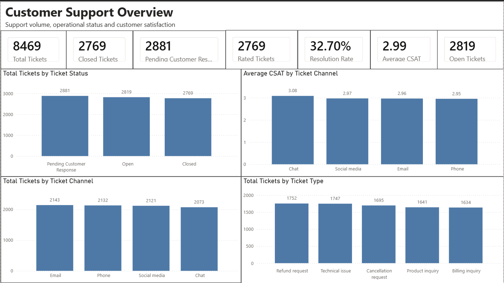
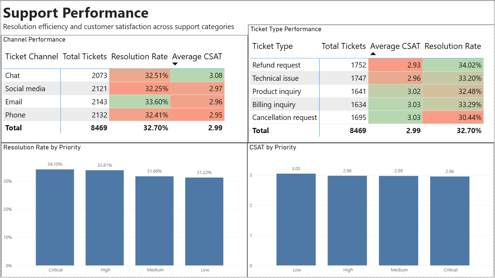
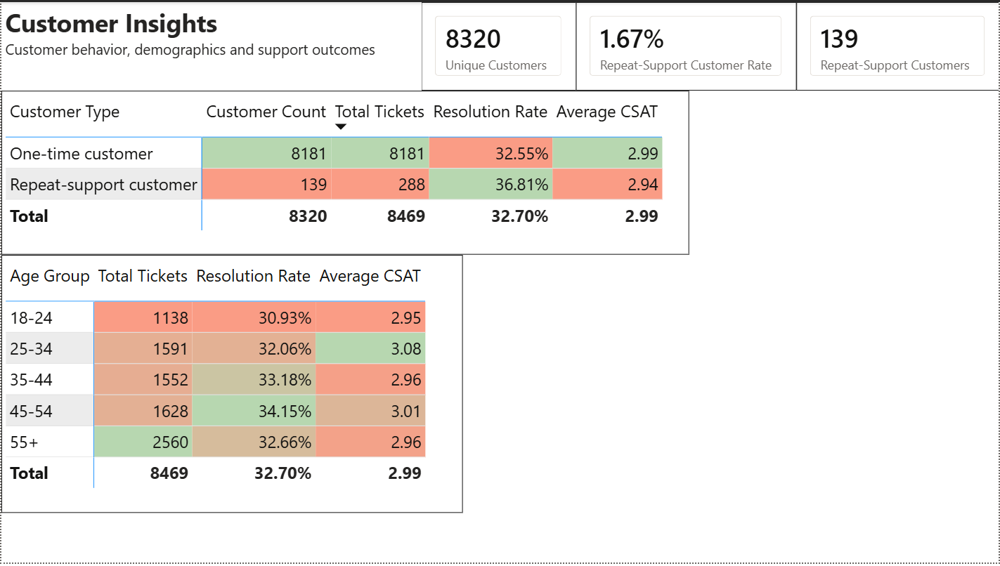

# Customer Support Analytics

## Project Overview

This project analyzes customer support ticket data to understand support demand, resolution performance, and customer satisfaction.

I worked with **8,469 support tickets** and used Python for data preparation, MySQL for analysis, and Power BI for the final dashboard.

The main questions were around where support demand was highest, how well tickets were being resolved, and where customer satisfaction was weaker.

## Business Questions

I wanted to answer questions such as:

* How large is the overall support workload?
* What percentage of tickets are resolved?
* Which ticket types generate the most support demand?
* Which ticket types have weaker resolution or CSAT?
* How do support channels compare?
* Does ticket priority affect resolution and satisfaction?
* Which products generate significant support demand?
* Do customer age groups have different support outcomes?
* Do repeat-support customers have different resolution and satisfaction levels?
* Where are the main opportunities for improving support performance?

## Tools Used

* **Python / Pandas** — data inspection, cleaning, and validation
* **MySQL** — SQL analysis and business questions
* **Power BI** — DAX, data visualization, and dashboard
* **CSV / Excel** — initial data handling

## Project Workflow

```text
Raw CSV
   ↓
Python / Pandas
Data inspection + cleaning + validation
   ↓
MySQL
SQL business analysis
   ↓
Power BI
DAX + dashboard
   ↓
Insights + recommendations
```

## Key KPIs

| KPI                      |     Result |
| ------------------------ | ---------: |
| Total Tickets            |  **8,469** |
| Unique Customers         |  **8,320** |
| Closed Tickets           |  **2,769** |
| Resolution Rate          | **32.70%** |
| Average CSAT             |   **2.99** |
| Repeat-support Customers |    **139** |

## Key Findings

### Resolution performance

**32.70% of tickets were closed.**

This made resolution performance one of the main areas of focus in the analysis. I also compared resolution rates across ticket types, channels, and priorities to see where performance differed.

### Refund requests

Refund requests generated the **highest ticket volume** among ticket types and had a relatively low **CSAT of 2.93**.

The combination of high demand and lower satisfaction makes refund-related support an area worth investigating further.

### Cancellation requests

Cancellation requests had the **lowest resolution rate among ticket types at 30.44%**.

Since cancellations also represent a significant amount of support demand, the cancellation process may be worth reviewing in more detail.

### Support channels

**Chat had the highest average CSAT at 3.08**, compared with **2.95 for Phone**.

This difference is worth investigating to understand whether there are practices in the Chat experience that could be useful in other support channels.

### Ticket priority

Critical tickets had the highest resolution rate at approximately **34.10%**, but their CSAT was approximately **2.96**, the lowest among the priority groups.

This shows why resolution rate alone is not enough to evaluate the customer support experience. A ticket can be closed while the customer experience is still relatively poor.

## Power BI Dashboard

The Power BI report contains three pages.

### Page 1 — Customer Support Overview

Provides a high-level view of:

* Total tickets
* Ticket status
* Ticket volume by channel
* Ticket volume by type
* CSAT by channel

### Page 2 — Support Performance

Focuses on:

* Ticket type performance
* Channel performance
* Resolution rate by priority
* CSAT by priority

### Page 3 — Customer Insights

Focuses on:

* Age-group performance
* Repeat-support customer performance
* Customer volume
* Resolution rate
* CSAT

## Data Cleaning

I used Python/Pandas before starting the SQL analysis.

The main preparation included:

* Inspecting the dataset structure
* Checking data types
* Checking missing values
* Checking duplicate Ticket IDs
* Validating important fields
* Cleaning the CSAT column
* Checking customer age values
* Validating the cleaned data before analysis

There were **no missing or duplicate Ticket IDs**.

Missing CSAT values were kept as blank rather than being treated as a score of zero, since a missing rating means the customer did not provide a rating.

The cleaned dataset was saved as:

```text
customer_support_tickets_cleaned.csv
```

## SQL Analysis

I used MySQL to investigate the main business questions.

The analysis covered:

* Ticket volume
* Resolution performance
* Customer satisfaction
* Ticket types
* Support channels
* Ticket priority
* Product support demand
* Customer age groups
* Repeat-support customers

I also used SQL techniques such as **joins, CTEs, conditional aggregation, window functions, and ranking** where they helped answer the business questions.

The focus was on using SQL to understand the data rather than simply demonstrating SQL syntax.

## Recommendations

Based on the analysis, I would consider the following areas for further investigation:

* Review the **refund process** because of its combination of high ticket volume and lower CSAT.
* Investigate the **cancellation workflow** because it had the lowest ticket-type resolution rate.
* Look at the **Chat support experience** to understand why it had the highest CSAT.
* Review unresolved and pending tickets to better understand the reasons behind the overall **32.70% resolution rate**.
* Evaluate support performance using **ticket volume, resolution rate, and CSAT together** rather than relying on a single metric.

These recommendations are based on patterns in the dataset and should be investigated further before making operational changes.

## Power BI Dashboard

The Power BI report contains three pages covering overall support performance, ticket/channel analysis, and customer insights.

### Page 1 — Customer Support Overview



### Page 2 — Support Performance



### Page 3 — Customer Insights


## Limitations

There are several limitations to this dataset:

* It is a single support-ticket table rather than a complete customer database.
* It does not provide reliable customer lifetime value or revenue impact.
* CSAT is not available for every ticket.
* The dataset cannot establish causal relationships.
* The available information does not support strong conclusions about actual resolution speed.
* Product-level analysis is mainly based on support demand and customer experience, rather than revenue or profitability.

## Project Files

```text
customer-support-analytics/
│
├── data/
│   ├── raw/
│   └── processed/
│
├── python/
│   └── data_cleaning.ipynb
│
├── sql/
│   └── customer_support_analysis.sql
│
├── powerbi/
│   └── customer_support_dashboard.pbix
│
├── documentation/
│   └── data_cleaning.md
│
└── README.md
```

## What I Learned

This project gave me practice taking a dataset from a raw CSV through cleaning, SQL analysis, and Power BI while keeping the business questions in mind at each stage.

The main workflow was:

**Python → SQL → Power BI → Business Insights**

I used Python to prepare and validate the data, SQL to investigate the questions, and Power BI to communicate the results.
